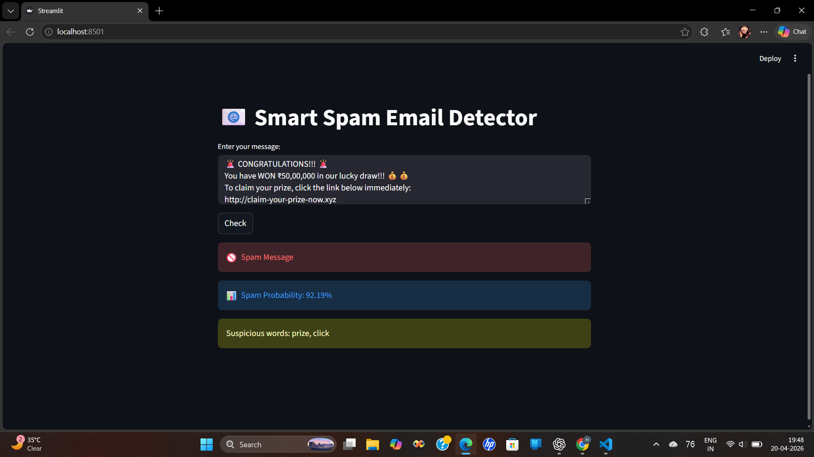

# 📧 Spam Email Detector

A Machine Learning project that classifies messages as **Spam** or **Ham (Not Spam)** using Natural Language Processing (NLP).

---

## 🚀 Features
- Real-time message classification
- Simple and interactive web interface
- Trained on real-world SMS dataset
- Fast and accurate predictions

---

## 🛠️ Tech Stack
- Python
- Scikit-learn
- NLTK
- Streamlit

---

## 📊 Model Details
- Algorithm: Naive Bayes
- Dataset: UCI SMS Spam Collection
- Accuracy: 97%+

---

## 📸 Screenshots

### Example Prediction


---

## ▶️ Run Locally

```bash
git clone https://github.com/habib-mallick-ai/spam-email-detector.git
cd spam-email-detector
pip install -r requirements.txt
streamlit run app.py
